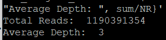

\newpage 

# Introduction

## Overview of the Original Paper
Chromatin immunoprecipitation followed by sequencing (ChIP-seq), is a powerful technique that gives researchers insights into the regulatory mechanisms governing cell identity, development, and disease [1]. ChIP-seq has led to the development of many cutting-edge methodologies, such as predicting gene expression levels, delineating chromatin loops, and addressing data imputation challenges. 

In the study titled "Methods for ChIP-seq Analysis: A Practical Workflow and Advanced Applications," researchers outline a practical workflow from processing raw ChIP-seq data, all the way to calling peaks [1]. Furthermore, the study brings to light some ideas to utilize the peaks data for more complex analysis methods, thus demonstrating the versatility of ChIP-seq. Through comprehensive examination of both foundational techniques and cutting-edge methodologies, this study showcases the potential of ChIP-seq analysis in unraveling the mysteries of the epigenome and its implications for human health and disease. Furthermore, the study prompts for researchers to utilize their outlined workflows to further broaden the knowledge for methodologies that can be executed using ChIP-seq data.

One of the methods mentioned in the study to analyze chip-seq data is motif analysis, which is a form of analysis that that attempts to determine which DNA-binding transcription factors control the transcription of a set of genes [2]. This is done by detecting enrichment of known binding motifs in the genes’ regulatory regions. While the study in question does not provide a more comprehensive overview of how to perform motif analysis, this paper will attempt to perform motif analysis on ChIP-seq peaks data from breast cancer tissue, in order to explore a possible avenue of analysis of ChIP-seq data.

## Significance of Reproducing the Study
The reproduction of this study would serve several important purposes. Firstly, the study would validate data pipeline proposed, while being able to identify further considerations and ways to optimize the data, addressing questions that were not initially addressed. Furthermore, by reconstructing a reproducible data pipeline, as well as looking for further ways to optimize the data pipeline, this would open the door for more novel analyses to be conducted, which will be done in this paper, as we will be conducting analysis comparing ChIP-seq data from cancerous breast tissue with normal breast tissue.

## Scope of the Re-Analysis
The re-analysis of this study involves constructing the data pipeline proposed in the study from scratch in a reproducable way, as well as doing further analysis on ChIP-seq data from cancerous breast tissue, as mentioned before. Firstly, the proposed data pipeline will be reconstructed, and several of the quality control (QC) measures mentioned in the original study will be explored, all while highlighting any considerations that may have been missed in the original study. Once peaks are called, further analysis will be performed. We will be constructing algorithms in R to learn more about genomic information surrounding breast cancer. This involves visualization of peaks, peak annotation, as well as motif analysis, which will attempt to determine the frequency of several motifs associated with breast cancer (Sp1, and NF-kB), which can be compared to ChIP-seq data from a normal patient.

Ultimately, this approach aims to confirm the study's methods and reveal new details about the causes of breast cancer, possibly finding new markers or treatments for the disease, or at least point researchers in more specific directions of what to focus on for further analysis to learn more about breast cancer.

# Methods and Results

## Data Pipeline, and Tools Used
A CentOS server was used to store raw data, as well as execute commands to run the data pipeline. Snakemake, a python syntax-based tool was used to construct a pipeline to run the steps listed above. A dependency chart can be seen below of the pipeline.


## Obtaining FASTQ Files
The original study states that fastQ files were taken from public datasets, such as the ENCODE portal, ROADMAP epigenome database, and IHEC Data Portal [1].For this analysis, data was gathered from the ENCODE portal:

A subset of histone chip-seq in MCF-7 (breast cancer) data was gathered, targeting the H3K4me2 histone modification. The library number of the subset of data is ENCLB352TP, with accession number ENCFF002ACV [3].

A subset of histone chip-seq in normal breast tissue of a female adult (51 years) was gathered as reference data, also targeting H3K4me3 histone modification. The library number of the subset of data is ENCLB123SQH, with accession number ENCFF037EZW [4].

## Data Pipeline
This pipeline was created in Snakemake. Note that in the case of dependency issues with Snakemake and deeptools, one may have to run MACS2 separately. Each step will be explained more in depth in the following sub-sections. To be reproducable, the user only has to update the FILENAME field. One could also use a config file and adjust the beginning of the Snakefile to make it configurable.

```{python, eval=FALSE, python.reticulate=FALSE}
FILENAME = "ENCFF002ACV"

rule all:
    input:
        f"aligned/{FILENAME}_aligned_sorted.bam.bai",
        f"peaks/{FILENAME}_peaks.bed",
        f"peaks/{FILENAME}_peaks.xls",
        f"{FILENAME}.flagstat",
        f"{FILENAME}_read_depth.txt"

rule align:
    input:
        fastq = f"Cancer/{FILENAME}.fastq.gz",
    output:
        sam = f"aligned/{FILENAME}_aligned.sam"
    shell:
        f"bowtie2 -x /projects/bmeg/indexes/hg38/hg38_bowtie2_index -U {{input.fastq}} -S {{output.sam}}"

rule sam_to_bam:
    input:
        sam = f"aligned/{FILENAME}_aligned.sam"
    output:
        bam = f"aligned/{FILENAME}_aligned.bam"
    shell:
        f"samtools view -h -b -o {{output.bam}} {{input.sam}}"

rule sort:
    input:
        sam = f"aligned/{FILENAME}_aligned.bam"
    output:
        bam = f"aligned/{FILENAME}_aligned_sorted.bam"
    shell:
        f"samtools view -h -b -o {{output.bam}} {{input.sam}}"

rule index:
    input:
        bam = f"aligned/{FILENAME}_aligned_sorted.bam"
    output:
        bai = f"aligned/{FILENAME}_aligned_sorted.bam.bai"
    shell:
        f"samtools index {{input.bam}} {{output.bai}}"

rule bam_to_bigwig:
    input:
        f"aligned/{FILENAME}_aligned_sorted.bam"
    output:
        f"bigwig/{FILENAME}_aligned_sorted.bw"
    shell:
        f"bamCoverage -b {{input}} -o {{output}} -p 2"

rule flagstat:
    input:
        f"aligned/{FILENAME}_aligned_sorted.bam"
    output:
        f"{FILENAME}.flagstat"
    shell:
        f"""
        samtools flagstat {{input}} > {{output}}
        """

rule read_depth:
    input:
        f"aligned/{FILENAME}_aligned_sorted.bam"
    output:
        f"{FILENAME}_read_depth.txt"
    shell:
        f"""
        samtools depth {{input}} \
        | awk '{{{{sum += $3}}}} END {{{{print "Total Reads: ", sum; print "Average Depth: ", sum/NR}}}}' \
        > {{output}}
        """

rule call_peaks:
    input:
        bam = f"aligned/{FILENAME}_aligned_sorted.bam",
        bai = f"aligned/{FILENAME}_aligned_sorted.bam.bai"
    output:
        peaks_bed = f"peaks/{FILENAME}_peaks.bed",
        peaks_xls = f"peaks/{FILENAME}_peaks.xls"
    shell:
        f"macs2 callpeak -t {{input.bam}} -f BAM -g hs -n {FILENAME} -B \
        --outdir peaks --pvalue 0.1 --qvalue 0.1"

```


## Sequence Alignment
In this recreation of the pipeline proposed, Bowtie2 will be used for sequence alignment, as it is known to utilize the strength of the full-text minute index, and hardware-accelerated dynamic programming algorithms to achieve high speed, sensitivity, and accuracy [5]. By default, Bowtie2 gives a SAM file output.

## File Conversion, Sorting, Indexing
Due to Bowtie2 giving a SAM file output, file conversion to BAM must be done, as MACS2 peaks calling is done with BAM file format. MACS2 also requires indexing to be done, and indexing requires sorting to be done on the BAM file. Thus, the order of these steps are to convert the SAM file to BAM, and then sort, and index the BAM file. Samtools was used to convert the SAM file to BAM file format. The BAM file was then sorted, and indexed, all using samtools again. Now, with the bam file, and the indexed bam file (.bai), peaks calling can be performed.

## Calling Peaks
Then, peaks could be called using MACS2. MACS2’s default settings try to balance sensitivity and specificity in order to minimize false positives while identifying statistically significant peaks. The study in question states that a general practical strategy is to obtain a large number of peaks when peak calling, with a relaxed threshold, containing true positives and noise. Then, subgroups can be extracted to improve specificity. In this specific recreation, there will be relaxed thresholds used, and then normalization will occur to remove noise and improve specificity. As per this suggestion, a more relaxed p-value was used of 0.1, compared to the default 0,05, resulting in more peaks being called, including those with lower significance [6]. 

## Quality Check
The original paper states that quality check (QC) of ChIP-seq samples is critical, as it helps one judge whether sequencing data is suitable for further analysis [1]. They outline several QC measures. One of the QC measures outlined is mapping ratio, which reflects read quality, and the proportion of sequenced reads that are derived from true genomic DNA. They state that the mapping ratio for samples sequenced by Illumina HiSeq System should be over 80%, and thus this is a good marker to use for quality checking the ChIP-seq data used in this paper.
Another QC measure mentioned is read depth. While read depth depends on genome size and antibody S/N ratio, the original paper states that there should be at least 10 million uniquely mapped reads, in order to analyze sharp-mode peaks of human samples [1]. 

Samtools was used for both determining mapping ratio, and read depth.Running the data pipeline will produce .flagstat files for mapping ratio, and .txt files for read depth. The output from running these files can be seen below:

  
  
The first image shows the mapped reads for the cancerous breast tissue data, while the second image shows the mapped reads for the normal breast tissue data. Both samples have a percentage well above 80%, thus both of these data samples pass this part of the quality check.
Next, total reads, and read depth can be checked. 

  
  
The top image shows the total reads and average depth for the cancerous data, while the lower image shows the total reads and average depth for the normal data. The value 3 is a rather low value, which may indicate inadequate sequencing coverage for certain applications such as ChIP-seq peak analysis. While the original study mentions read depth, they do not specify any ideal read depth level. In general however, higher read depths are typically preferred to ensure accurate detection of peaks and enhance the reliability of downstream analyses. 
On the other hand, both samples do have plenty of reads, well above the threshold that the original study said stated there should be.

## Pre-Processing and Visualization of Peaks
Data analysis and visualization was then performed in RStudio. RMarkdown files for processing both the peaks data for both the cancerous and normal data can be found in the appendix. The code blocks displayed in this section will only refer to the code for the peaks of the cancerous ChIP-seq data. 
It is also important to mention that MACS2 returned peaks data in multiple file types, one of which was .xls. This data was manually processed into xlsx data in order to be processed in RStudio, as well as opened in an Excel spreadsheet to remove the comments at the top of the file.

Code including descriptive comments are included below to show the visualization of peaks data.


```{r, eval=TRUE}
#Load the summits.bed file 

library(ggplot2)
summitscancer <- 
read.table("C:/Users/chenn/Documents/bmeg424/Final/cancerdata/new/ENCFF002ACV_summits.bed",
           header = FALSE)

library(ggplot2)
summitsnormal <- 
read.table("C:/Users/chenn/Documents/bmeg424/Final/normaldata/ENCFF037EZW_summits.bed",
             header = FALSE)

#visualization of peaks

library(openxlsx)

# Plot the summit positions for Cancer Data
plot(summitscancer$V2, summitscancer$V5, type = "p", col = "red", pch = 20, 
     xlab = "Genomic Position", ylab = "Summit Height", 
     main = "ChIP-seq Summit Positions (Cancer)")

# Plot the summit positions for Normal Data
plot(summitsnormal$V2, summitsnormal$V5, type = "p", col = "red", pch = 20, 
     xlab = "Genomic Position", ylab = "Summit Height", 
     main = "ChIP-seq Summit Positions (Normal)")

```

Intuitively, it can be observed that on average, there are much higher peaks for the data of the normal patient. However, one major consideration when analyzing ChIP-seq data is library size. Based on the QC step, it was discovered that the cancerous tissue data subset contained around 11 million reads, where the regular breast tissue data subset contained around 17 million. The difference in peaks are likely due to differences in library size.

These differences in library sizes suggest that some pre-processing of the data needs to be done. One way to normalize ChIP-seq data to account for library size is to do TMM normalization. This would normalize the data, adjusting for various library sizes [7]. Furthermore, filtering peaks can be performed, by finding counts per million (CPM) of peaks, and filtering out data that sits below this threshold. The purpose of this is to account for differences in sequencing depth between samples, as well as remove data that is possibly just noise, thereby focusing the analysis on more biologically relevant regions with higher enrichment. The code for both normalization and data filtering is shown below:


```{r, eval=TRUE}

#This block of code loads the XLSX peaks data and 
#properly organizes the data into having 10 columns rather 
#than store all the data in a single column, and sets column names.

library(tidyr)
library(dplyr)
library(edgeR)

peaks_data_cancer <- 
read.xlsx("C:/Users/chenn/Documents/bmeg424/Final/cancerdata/new/ENCFF002ACV_peaks.xlsx")

peaks_data_normal <-
read.xlsx("C:/Users/chenn/Documents/bmeg424/Final/normaldata/ENCFF037EZW_peaks.xlsx")

names(peaks_data_cancer)[names(peaks_data_cancer) == 
"chr.start.end.length.abs_summit.pileup.-log10(pvalue).fold_enrichment.-log10(qvalue).name"] <- "new"

names(peaks_data_normal)[names(peaks_data_normal) == 
"chr.start.end.length.abs_summit.pileup.-log10(pvalue).fold_enrichment.-log10(qvalue).name"] <- "new"

#Rename the column names for both peaks data frames
peaks_data_cancer <- 
  separate(peaks_data_cancer, new, into = paste0("col", 1:10), sep = "\\s+")
peaks_data_normal <- 
  separate(peaks_data_normal, new, into = paste0("col", 1:10), sep = "\\s+")

col_names <- 
  c("chr", "start", "end", "length", "abs_summit", "pileup", "-log10(pvalue)", 
    "fold_enrichment", "-log10(qvalue)", "name")

names(peaks_data_cancer) <- col_names[1:length(peaks_data_cancer)]
names(peaks_data_normal) <- col_names[1:length(peaks_data_normal)]

#This block of code is TMM normalization to account for library size
#Filter out reads below 10cpm.


#First for Cancer:

pileup_counts_cancer <- peaks_data_cancer$pileup
d_cancer <- DGEList(counts = as.numeric(pileup_counts_cancer))

# Perform TMM normalization
d_cancer <- calcNormFactors(d_cancer, method = "TMM")

normalized_counts_cancer <- cpm(d_cancer)

threshold <- 10 
peaks_df_cancer <- as.data.frame(peaks_data_cancer)

# Filter peaks based on the threshold
filtered_peaks_cancer <- peaks_df_cancer[normalized_counts_cancer > threshold, ]

#Repeat for the Normal Data:

pileup_counts_normal <- peaks_data_normal$pileup

d_normal <- DGEList(counts = as.numeric(pileup_counts_normal))

# Perform TMM normalization. 
d_normal <- calcNormFactors(d_normal, method = "TMM")

# Access normalized counts
normalized_counts_normal <- cpm(d_normal)

threshold <- 10 
peaks_df_normal <- as.data.frame(peaks_data_normal)

# Filter peaks based on the threshold
filtered_peaks_normal <- peaks_df_normal[normalized_counts_normal > threshold, ]

```

After running the above code, the filtered_peaks data frame now contains the data that has been normalized and filtered. 

With this data, functional analysis can be conducted using established pipelines commonly applied to ChIP-seq data, such as annotation, functional enrichment, and motif discovery [8]. These analyses could offer valuable insights into the biological disparities between normal and cancerous breast tissue samples. Identification of deregulated or up-regulated genomic features may guide further investigation into specific regions with altered gene regulation or epigenetic modifications, shedding light on the underlying mechanisms driving the observed differences between the two conditions. In this paper, ChIPseeker will be used to perform and visualize peak annotation.

The original study suggests additional analyses after processing the data, such as chromatin-state annotation which involves identifying genomic regions by their epigenomic patterns, like promoters and enhancers. Although the study discusses using machine-learning algorithms for unsupervised clustering to annotate these regions, this paper will use the ChIPseeker package in R instead. ChIPseeker helps annotate ChIP-seq peaks with genomic features, identifies nearby genes, analyzes peak distribution near transcription start sites (TSS), and conducts enrichment analysis for gene functions and pathways. This method will help us understand the roles and importance of the peaks in both cancerous and normal samples. It will also allow us to compare the regulatory differences between the two sets, potentially shedding light on cancer development and progression.

## Preparing Data for Analysis

This block of R code pre-processes ChIP-seq filtered peak data, ensuring numerical columns are correctly formatted. It also ensures certain columns are numeric like peak positions, summit locations, and enrichment scores, to ensure it is prepared for further analysis.

```{r, eval=TRUE}
#Set the filtered peaks as a data table, and ensure that columns with numeric
#data is set to numeric in case the data is of "string" type.

#Perform this process on the Cancer Data

library(data.table)

setDT(filtered_peaks_cancer)

numeric_cols <- c("start", "end", "length", "abs_summit", "pileup", 
                  "-log10(pvalue)", "fold_enrichment", "-log10(qvalue)")
filtered_peaks_cancer[,
            (numeric_cols) := lapply(.SD, as.numeric), .SDcols = numeric_cols]

#Now repeat for the Normal data
setDT(filtered_peaks_normal)

filtered_peaks_normal[,
            (numeric_cols) := lapply(.SD, as.numeric), .SDcols = numeric_cols]

```

```{r, eval=TRUE}
#define enhancer regions by extending peak summits
library(GenomicRanges)

#Start with Cancer Data:

peaks_gr_cancer <- with(filtered_peaks_cancer,
            GRanges(seqnames = chr, ranges = IRanges(start = start,end = end)))

merged_gr_cancer <- reduce(peaks_gr_cancer)

merged_peaks_data_cancer <- as.data.frame(merged_gr_cancer)

#Repeat for Normal Data:
peaks_gr_normal <- with(filtered_peaks_normal, GRanges(seqnames = chr, 
                                    ranges = IRanges(start = start,end = end)))

merged_gr_normal <- reduce(peaks_gr_normal)

merged_peaks_data_normal <- as.data.frame(merged_gr_normal)

```

\newpage

## Plotting Feature Distribution

The following code performs peak annotation and visualization for both datasets. Using the ChIPseeker package, it annotates peaks relative to transcription start sites (TSS) within a specified region, converts the annotated peaks into both GRanges and data frame formats for further analysis, and then visualizes the distribution of genomic annotations.

```{r, eval=TRUE}
#load human genome reference database
library(TxDb.Hsapiens.UCSC.hg38.knownGene)
library(org.Hs.eg.db)
library(GenomeInfoDb)
library(ChIPseeker)

#For Cancer Data:

#Perform and Visualize Peak Annotation
peakAnno_cancer <- annotatePeak(merged_gr_cancer, tssRegion =
                        c(-500, 500), TxDb = TxDb.Hsapiens.UCSC.hg38.knownGene,
    annoDb = "org.Hs.eg.db")

peakAnno_GR_cancer <- as.GRanges(peakAnno_cancer)
peakAnno_DF_cancer <- as.data.frame(peakAnno_cancer)

plotAnnoBar(peakAnno_cancer, 
            main = "Annotation Distribution of Peaks in Cancer Data")

#Repeat for Normal Data:

peakAnno_normal <- annotatePeak(merged_gr_normal, tssRegion = 
                        c(-500, 500), TxDb = TxDb.Hsapiens.UCSC.hg38.knownGene,
    annoDb = "org.Hs.eg.db")

peakAnno_GR_normal <- as.GRanges(peakAnno_normal)
peakAnno_DF_normal <- as.data.frame(peakAnno_normal)

plotAnnoBar(peakAnno_normal,
            main = "Annotation Distribution of Peaks in Normal Data")

```
The above two images show the feature distribution graphs of cancerous (top) and healthy breast tissue (bottom).The healthy breast tissue shows notably more promoters, and less 1st introns than the cancerous tissue. It is plausible that the observation of more promoters in the normal breast tissue data could suggest that there is down-regulation of some key genes in the cancerous tissue. This could prompt researchers to look more closely into the expression of key genes that regulate critical cellular processes such as cell cycle control, DNA repair mechanisms, and tumor suppression pathways. 
Furthermore, the observation of considerably more first introns, or 5' introns in the cancerous breast tissue compared to the healthy breast tissue is also notable. These introns play key roles in gene expression and regulation, and a greater amount in cancerous tissue could suggest that there's a dysregulation of transcriptional regulatory factors, leading to altered expression patterns of certain genes, possibly leading to increased transcription of genes with multiple first introns.This finding could prompt researchers to look closer at some regulatory genes for the cancerous data, such as TP53.

## Plotting Peak Distributions Around TSS Sites

Next, the distributions of peaks around TSS sites can be plotted:

```{r, eval=TRUE}

#Plot distribution of peaks around TSS Sites:

plotDistToTSS(peakAnno_cancer, 
              main = "Distribution of Peaks Relative to TSS in Cancer Data")

plotDistToTSS(peakAnno_normal,
              main = "Distribution of Peaks Relative to TSS in Normal Data")

```
The above images show graphs representing the distribution of transcription factor-binding loci relative to TSS, where the top figure is for cancerous breast tissue, and the lower figure is for normal breast tissue.
It can be observed that for the normal breast tissue data, there is a greater percentage of binding sites within closer ranges. Transcription factor binding sites (TFBS) located closer by (0-1kb range) are often associated with promoter and enhancer regions, which are critical regulatory elements. Thus, it would make sense intuitively that the normal data has a greater percentage of binding at these regions. These graphs further support the idea of alterations occurring in gene regulation and transcriptional control associated with cancer, and more specifically with a focus on promoter regions.

## Plotting overlap between annotations

The provided code block utilizes the ggupset package to describe and visualize the overlap between genomic annotations in cancerous and normal breast tissue ChIP-seq data. It generates UpSet plots, which are an alternative to Venn diagrams for complex datasets, to effectively display the intersections of genomic features like promoters, enhancers, and genes.

```{r, eval=TRUE}
#Describe overlap between annotations:
library(ggupset)


upsetplot(peakAnno_cancer, vennpie = FALSE) +
  ggtitle("Overlap Between Annotations (Cancer)")

upsetplot(peakAnno_normal, vennpie = F) +
  ggtitle("Overlap Between Annotations (Normal)")

```
The graphs above represent the overlap between annotations in cancerous breast tissue data, where the top figure is for cancerous breast tissue, and the bottom figure is for normal breast tissue.
It can be observed that the normal breast tissue data faces an overwhelming majority of overlaps "genic, intron, promoter, exon, fiveUTR". These are all parts of the genome involved in gene expression, which means it's expected that the cancer data is showing a wider spread of overlaps, as this suggests there can be some more disorganized genetic regulation happening.The cancer data has a much greater spread of different overlaps, which further indicates that different pathways may be disrupted or activated compared to the normal cells. This could prompt researchers to look closer into the mechanism that might be influencing these changes. For example, one could combine these findings with gene expression changes between cancerous and normal data to try to determine specific genes that are causing this difference as an avenue of further study.

## Motif Analysis 

In the original study, motif analysis is mentioned as a form of functional analysis. Motif analysis can be defined in 2 ways. De novo motif discovery involves identifying potential new binding motifs for unknown factors appearing in a large fraction of peaks, and motif scanning estimates and ranks the similarity of supplied DNA sequences against all known canonical motifs within a database [1].
This specific report will attempt motif scanning. 2 transcription factors associated with breast cancer, Specificity Protein 1 (Sp1) and Nuclear Factor-kappa B (NF-kB). 
Sp1 is a zinc finger transcription factor that binds to GC-rich motifs in the promoter regions of many genes, and regulates the expression of  a wide range of genes involved in biological processes like cell proliferation, differentiation, apoptosis, and response to stress [9]. Higher levels of Sp1 expression has been associated with breast cancer due to these reasons, as well as its regulation of tumor suppressor genes, and interaction with hormone receptors like estrogen receptor alpha [10]. The sequence of Sp1 is 5'-GGGCGG-3'.
NF-kB is a family of transcription factors, that also has the role of regulating the expression of genes. It has been implicated in breast cancer development progression as well [11]. The sequence of NF-kB is  5'-GGGRNNYYCC-3', where R is a purine (A or G), N is any nucleotide, and Y is a pyrimidine (C or T). 

The below code extracts genomic sequences based on peak coordinates from ChIP-seq data using the BSgenome.Hsapiens.UCSC.hg38 package, which contains human reference genome sequence data. A function was created to retrieve sequences from specific chromosomes, and this function was applied to both sets of data, and saved into FASTA format, to be used for motif analysis.  


```{r, eval=TRUE}
#Save FASTA file for motif analysis
# Define a function to extract sequences from the genome based on peak 
#coordinates, Extract sequences based on peak coordinates, 
#and then write the sequecnes to a FASTA file.

library(BSgenome.Hsapiens.UCSC.hg38) 


extract_peak_sequences <- function(chr, start, end) {
  genome_sequences <- 
  getSeq(BSgenome.Hsapiens.UCSC.hg38, names=chr, start=start, end=end)
  
  return(genome_sequences)
}

#Establish peak sequences for the cancer data
peak_sequences_cancer <- extract_peak_sequences(filtered_peaks_cancer$chr, 
                                      filtered_peaks_cancer$start, 
                                      filtered_peaks_cancer$end)

#Establish peak sequences for normal data
peak_sequences_normal <- extract_peak_sequences(filtered_peaks_normal$chr, 
                                      filtered_peaks_normal$start, 
                                      filtered_peaks_normal$end)

# Write sequences to a FASTA file
writeXStringSet(peak_sequences_cancer, file = "peaks_cancer.fasta")
writeXStringSet(peak_sequences_normal, file = "peaks_normal.fasta")


```

The next block of code processes the FASTA data into DNAStringSet objects, which contain the sequences from the cancerous and normal breast tissue data. SP1 and NF-kB are defined, and expressed as regular expressions.The "gregexpr" function was used to find matches for each motif in the genome sequences, and these results were printed.

```{r, eval=TRUE}

#Motif Analysis

library(Biostrings)

# Load genome sequences
genome_sequences_cancer <- readDNAStringSet("C:/Users/chenn/Documents/bmeg424/Final/peaks_cancer.fasta")
genome_sequences_normal <- readDNAStringSet("C:/Users/chenn/Documents/bmeg424/Final/peaks_normal.fasta")

# Define motifs with optimized regex
motifs <- c("GGGCGG", "GGG[AG][AT]C[CT][CT]CC") 

# Define a list containing both sets of genome sequences
genome_sequences_list <- list(cancer = genome_sequences_cancer, 
                              normal = genome_sequences_normal)

# Perform motif analysis for each set of genome sequences
results <- list()
for (dataset_name in names(genome_sequences_list)) {
  results[[dataset_name]] <- list()
  for (motif in motifs) {
    motif_matches <- 
      gregexpr(motif, as.character(genome_sequences_list[[dataset_name]]))
    motif_count <- sum(unlist(lapply(motif_matches, length)))
    results[[dataset_name]][[motif]] <- motif_count
  }
}

# Print results
for (dataset_name in names(results)) {
  cat("Dataset:", dataset_name, "\n")
  for (motif in names(results[[dataset_name]])) {
    cat("Motif:", motif, "\n")
    print(results[[dataset_name]][[motif]])
  }
}

```

These motif occurences can be plotted.

```{r, eval=TRUE}

# Motif data
motif_names <- c("Sp1", "NF-kB")

motif_counts_cancer <- c(27192, 19648)
motif_counts_normal <- c(46890, 22435)

# Create data frames with dataset information
motif_df_cancer <- data.frame(Motif = motif_names, Count = motif_counts_cancer, Dataset = "Cancer")
motif_df_normal <- data.frame(Motif = motif_names, Count = motif_counts_normal, Dataset = "Normal")

# Combine data frames
motif_df <- rbind(motif_df_cancer, motif_df_normal)

# Plot both the cancer and normal motifs with a legend
library(ggplot2)
ggplot(motif_df, aes(x = Motif, y = Count, fill = Dataset)) +
  geom_bar(stat = "identity", position = "dodge") +
  labs(title = "Motif Occurrences",
       x = "Motif",
       y = "Count",
       fill = "Dataset") +
  theme_minimal() +
  theme(axis.text.x = element_text(angle = 45, hjust = 1))
```

The above graph shows the motif occurrences for cancer (red) and normal (blue) data. Interestingly, there are a very similar number of NF-kB occurences in both the normal and cancerous breast tissue data. In contrast, there is a significantly higher number of occurences of Sp1 in the normal data compared to the cancer data. This suggests that regions of DNA containing these Sp1 binding sites are more accessible and/or numerous in normal cells. 
This is actually not the expected result, as there is literature that states protein expression of Sp1 is usually higher in breast, ovarian, colon and lung cancer, compared with corresponding tissues [https://www.ncbi.nlm.nih.gov/pmc/articles/PMC8262197/]. Thus, these findings may seem counter-intuitive. However it is important to note that the genome is an incredibly complex system. It is possible that in cancerous tissues, SP1 motifs are less frequent, because the cancer cells have developed mechanims that compensate for the need of direct SP1 binding.
Another factor to consider is post-translational modifications. The activity of Sp1 can be regulated post-translationally, through various modifications like phosphorylation, glycosylation, and acetylation. Thus, it is possible that SP1 proteins are modified in cancer cells, such that they are active even with less binding sites to the DNA.
Due to the complexity of how the genome, and its associated biological processes works, these results are not necessarily unexpected, and prompts researchers to do further studies. A good avenue to go down from here regarding the discrepancy of SP1 binding would be to potentially directly measure Sp1 activity through measuring its transcriptional activation potential. This would involve assessing the actual influence of Sp1 on gene expression, beyond mere motif presence, by quantifying mRNA levels of target genes or utilizing reporter assays. This could help offer a more nuanced understanding of Sp1's functional role in cancerous versus normal cells, and help researchers understand this difference in motif occurrence.

\newpage

# Conclusion
By using the the proposed data pipeline in the study titled "Methods for ChIP-seq analysis: A practical workflow and advanced applications", we were able to run breast cancer ChIP-seq data through the data pipeline, as well as ChIP-seq data of regular breast tissue to produce peaks data. We were able to verify the pipeline, as well as bring into question some areas of improvement, such as potentially establishing a more concrete value to determine what is acceptable read depth.
This comprehensive approach also allowed us to perform peak annotation, visualize the distribution of peaks in relation to transcription start sites (TSS), explore the overlap between different genomic annotations, and conduct a detailed motif analysis, as well as develop an algorithm for motif analysis pertaining to comparing the breast cancer with normal breast tissue data. 
One surprising finding of the analysis was found in the results of the motif analysis. SP1 saw greater expression in the normal data, which went against what would normally be stated in other literature. This underlines the complexity of the human genome and its regulatory elements and processes, as well as the importance of exploring multiple avenues and algorithms to gain more insight into factors that may cause breast cancer.
Future studies that hope to use this similar version of data analysis using the pre-existing ChIP-seq data pipeline should attempt to work with larger sample sizes from multiple patients, while accounting for differences in ethnicity in order to enhance the statistical power and robustness of their findings. By incorporating data from a diverse patient cohort, researchers can better account for the genetic and epigenetic variability that characterizes breast cancer, thus enabling a more comprehensive understanding of disease mechanisms. 

\newpage

# References
[1] Nakato, Ryuichiro, and Toyonori Sakata. “Methods for Chip-Seq Analysis:
A Practical Workflow and Advanced Applications.” Methods, Academic Press, 30 Mar. 2020,  
www.sciencedirect.com/science/article/pii/S1046202320300591. 

[2] “Motif Analysis CTCF ChIP-Seq.” Workshop ChIPATAC 2020,  
www.hdsu.org/chipatac2020/10_motifCTCF.html#:~:text=One%20important%20step%20of%  
20the,marked%20by%20specific%20histone%20marks. Accessed 9 Apr. 2024.

[3] Bernstein, Bradley. “Experiment Summary for ENCSR875KOJ.” ENCODE, 
The ENCODE Data Coordination Center, 20 Feb. 2014,
www.encodeproject.org/experiments/ENCSR875KOJ/. 

[4] Bernstein, Bradley. “Experiment Summary for Encsr568qqu.” ENCODE, 
The ENCODE Data Coordination Center, 27 Apr. 2019,
www.encodeproject.org/experiments/ENCSR568QQU/. 

[5] Langmead, Ben, and Steven L Salzberg. “Fast Gapped-Read Alignment with Bowtie 2.”
Nature Methods, U.S. National Library of Medicine, 4 Mar. 2012,  
www.ncbi.nlm.nih.gov/pmc/articles/PMC3322381/#:~:text=Bowtie%202%20combines%20  
the%20strengths,high%20speed%2C%20sensitivity%20and%20accuracy. 

[6] Mistry, Meeta. “Peak Calling with MACS2.” Introduction to ChIP-Seq 
Using High-Performance Computing, 12 June 2017, 
hbctraining.github.io/Intro-to-ChIPseq/lessons/05_peak_calling_macs.html. 

[7] Robinson, Mark D, and Alicia Oshlack. “A Scaling Normalization Method for 
Differential Expression Analysis of RNA-Seq Data - Genome Biology.” BioMed 
Central, BioMed Central, 2 Mar. 2010, 
genomebiology.biomedcentral.com/articles/10.1186/gb-2010-11-3-r25. 

[8] Mary Piper, Radhika Khetani. “ChIP-Seq Peak Annotation and Functional 
Analysis.” Introduction to ChIP-Seq Using High-Performance Computing, 25 Apr. 2019, hbctraining.github.io/Intro-to-ChIPseq/lessons/12_functional_analysis.html. 

[9] GeneCards. "Gene: SP1." GeneCards: The Human Gene Database, Weizmann
Institute of Science, n.d., https://www.genecards.org/cgi-bin/carddisp.pl?gene=SP1.

[10] Gao, Yue, et al. “SP1 Expression and the Clinicopathological Features of 
Tumors: A Meta-Analysis and Bioinformatics Analysis.” Pathology Oncology Research:
POR, U.S. National Library of Medicine, 28 Jan. 2021,
www.ncbi.nlm.nih.gov/pmc/articles/PMC8262197/. 

[11] Al-Mutairi, Mashael Saqer, and Hany Onsy Habashy. 
“Nuclear Factor-ΚB Clinical Significance in Breast Cancer: 
An Immunohistochemical Study.” Karger Publishers, S. Karger AG, 11 May 2023, karger.com/mpp/article/32/1/33/835534/Nuclear-Factor-B-Clinical-Significance-in-Breast. 

